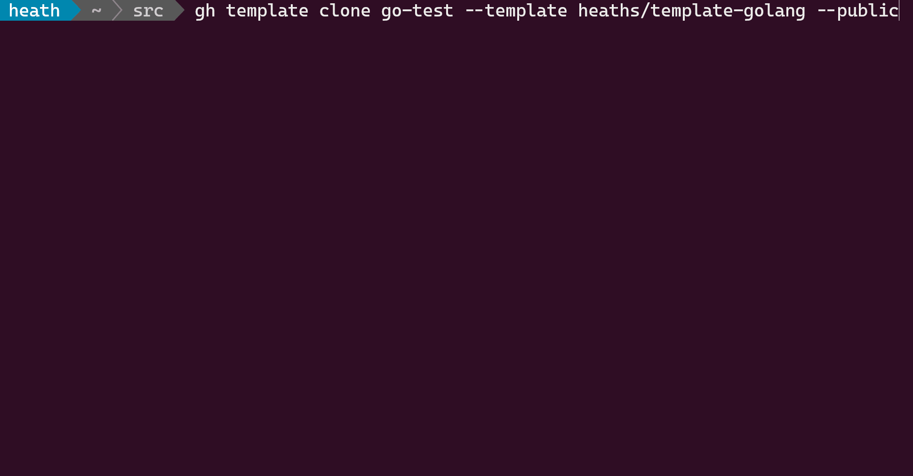

# Project Template Extension

[](https://github.com/heaths/gh-template/releases/latest)
[](https://github.com/heaths/gh-template/actions/workflows/ci.yml)

A [GitHub CLI] extension to format a project template.

## Install

Make sure you have version 2.0 or [newer] of the [GitHub CLI] installed.

```bash
gh extension install heaths/gh-template
```

## Usage

To create a new repository from a template and format it:

```bash
gh template clone <name> --template <template> --public
```



## Templates

You can format files in a template repository as template files.
Template files contain a mix of text and actions surrounded by `{{` and `}}` e.g.,

```markdown
# {{param "name" "" "What is the project name?" | titlecase}}

This is an example repository {{param "github.owner"}}/{{param "github.repo"}}.
```

You'll be prompted for any parameters not specified on the command line
or already defined by the `apply` command.

Directories and files are processed alphabetically, so you only need to
provide a default value and optional prompt for the first instance a parameter occurs
alphabetically in the repository.

Because the _.github/workflows_ directory may contain workflows with `${{ }}` expressions,
it is excluded automatically unless `--delims` is specified and not `{{` or `}}`.
If you need to format workflows as a template, consider using alternate delimiters
throughout your template repository e.g, `<%` and `%>`.

### Built-in parameters

Within a GitHub repository, the following parameters are already defined.

* `git.name`\
  The configured `user.name` for a Git repository.
* `git.email`\
  The configured `user.email` for a Git repository.
* `github.host`\
  The GitHub host e.g., "github.com" for "github.com/heaths/gh-template".
* `github.owner`\
  The GitHub owner e.g., "heaths" for "github.com/heaths/gh-template".
* `github.repo`\
  The GitHub repository name e.g., "gh-template" for "github.com/heaths/gh-template".

### Functions

In addition to [built-in](https://pkg.go.dev/text/template#hdr-Functions) functions,
the following functions are also available:

* `param <name> [<default> [<prompt>]]`\
  Replace with a parameter named `<name>`, or prompt using an optional `<default>`
  with an optional `<prompt>`. If a `<prompt>` is not specified, the required
  `<name>` is used. The type of `<default>` dictates valid input. Only `string`
  and `int` are supported at this time.
* `pluralize <count> <thing>`\
  Append an "s" to `<thing>` if `<count>` is not equal to 1. `<count>` can be
  either an `int` or a `string` representing an `int` e.g., "1".
* `lowercase <string>`\
  Change the case of `<string>` to all lowercase characters.
* `titlecase <string>`\
  Change the case of `<string>` to Title Case characters.
* `uppercase <string>`\
  Change the case of `<string>` to UPPERCASE characters.
* `replace <from> <to> <source>`\
  Replaces all occurrences of `<from>` to `<to>` in the `<source>` string.
* `date`\
  Returns the current UTC date-time.
* `date.Format <layout>`\
  Formats the date-time according to [`time.Format`](https://pkg.go.dev/time#Time.Format).
* `date.Local`\
  Returns the current local date-time. You can call other `date` functions
  on the returned value e.g., `date.Local.Year`.
* `date.Year`\
  Returns the current UTC year.
* `true`\
  Returns `true`. Useful as a default value to accept y\[es\] or n\[o\] answers.
* `false`\
  Returns `false`. Useful as a default value to accept y\[es\] or n\[o\] answers.
* `deleteFile`\
  Deletes the current file, or a list of file names relative to the repo root.

You can also nest function calls. To default a project name to the GitHub repo name, for example:

```text
{{param "name" (param "github.repo") "What is the project name?"}}
```

### Examples

See the following template repositories for examples:

* [heaths/template-golang](https://github.com/heaths/template-golang)
* [heaths/template-rustlang](https://github.com/heaths/template-rustlang)

## License

Licensed under the [MIT](LICENSE.txt) license.

[GitHub CLI]: https://github.com/cli/cli
[newer]: https://github.com/cli/cli/releases/latest
